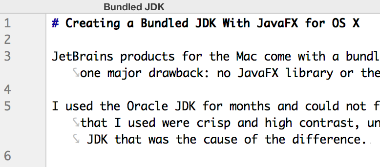
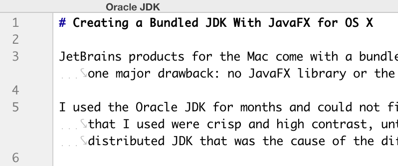

# Creating a Bundled JDK With JavaFX for OS X

JetBrains products for the Mac come with a bundled Open JDK which has much better text rendering than the Oracle JDK distributions but with one major drawback: no JavaFX library or the native libraries it depends on.

I used the Oracle JDK for months and could not figure out why my main IDE text looks so washed out when some of the debug configurations that I used were crisp and high contrast, until I realized it was the difference between the bundled open JDK and the Oracle distributed JDK that was the cause of the difference. 




Once I figured it out I switched to the bundled JDK and lived with the lack of JavaFX Preview until I ported the Markdown Support solution of an overlay JavaFX library.  

The overlay JavaFX zip which is used in Markdown Support plugin and idea-multimarkdown plugin, adds JavaFX WebView preview when running on the bundled JDK on the Mac but it has limitations. Mainly, the media support libraries are not included and even if they were they would not load except with the custom class loader used to load the overlay JavaFX library and when JavaFX/WebView is loaded by a custom class loader it fails to paint scroll bars in the rendered page. 

The lack of media libraries causes the overlay JavaFX WebView to crash when an SVG image is embedded in the HTML. The workaround used in Markdown Support and duplicated in idea-multimarkdown is to rename all SVG images so that they are not resolved by WebView preventing a crash, but also preventing them from being displayed.

While developing the idea-multimarkdown plugin I need to be able to see the full WebView preview with a non-bundled JDK but could not continuously work with the washed out text.

A little experimentation and I created a copy of the Bundled JDK with JavaFX files from the JavaFX overlay zip and the missing media libraries from Oracle JDK 1.8u66 distribution that gives me bundled JDK text rendering quality without sacrificing JavaFX WebView media rendering capabilities. 

To create one for yourself you need to:
 
1. Copy the bundled Open JDK from the JetBrains product that you are using to your `/Library/Java` directory. Different applications have different builds of the bundled JDK. I used PhpStorm 11 EAP because it has the latest `b119`. Check your installed JetBrains applications about box and use the one with latest build, or create more than one with different builds.  

2. The JavaFX overlay zip file used by Markdown Support or idea-multimarkdown is installed into the application's configuration directory, or you can download it from the same place the plugins download it;

3. Expand the zip into the jdk

4. Copy the missing native libraries from an Oracle distribution, use the latest available, on my system it was jdk1.8.0_66.jdk 

```shell
# 1. copy bundled JDK as a jdk under /Library/Java
sudo cp -fr /Applications/"PhpStorm EAP.app"/Contents/jre/jdk /Library/Java/JavaVirtualMachines/openjdk1.8.0_40b119

# 2. download the javafx sdk overlay
sudo curl --location http://download.jetbrains.com/idea/open-jfx/javafx-sdk-overlay.zip --output /Library/Java/JavaVirtualMachines/openjdk1.8.0_40b119/javafx-sdk-overlay.zip

# 3. expand it into place
sudo unzip -bq /Library/Java/JavaVirtualMachines/openjdk1.8.0_40b119/javafx-sdk-overlay.zip -d /Library/Java/JavaVirtualMachines/openjdk1.8.0_40b119/Contents/Home

# 4. copy the missing native libraries from the latest Oracle jdk installation
sudo cp /Library/Java/JavaVirtualMachines/jdk1.8.0_66.jdk/Contents/Home/jre/lib/libglib-lite.dylib /Library/Java/JavaVirtualMachines/openjdk1.8.0_40b119/Contents/Home/jre/lib
sudo cp /Library/Java/JavaVirtualMachines/jdk1.8.0_66.jdk/Contents/Home/jre/lib/libgstreamer-lite.dylib /Library/Java/JavaVirtualMachines/openjdk1.8.0_40b119/Contents/Home/jre/lib
sudo cp /Library/Java/JavaVirtualMachines/jdk1.8.0_66.jdk/Contents/Home/jre/lib/libjfxmedia.dylib /Library/Java/JavaVirtualMachines/openjdk1.8.0_40b119/Contents/Home/jre/lib
sudo cp /Library/Java/JavaVirtualMachines/jdk1.8.0_66.jdk/Contents/Home/jre/lib/libjfxmedia_avf.dylib /Library/Java/JavaVirtualMachines/openjdk1.8.0_40b119/Contents/Home/jre/lib
sudo cp /Library/Java/JavaVirtualMachines/jdk1.8.0_66.jdk/Contents/Home/jre/lib/libjfxmedia_qtkit.dylib /Library/Java/JavaVirtualMachines/openjdk1.8.0_40b119/Contents/Home/jre/lib
```

Now point your application to the newly created JDK and try it out. See idea-multimarkdown wiki [Changing Boot JDK]


[Changing Boot JDK]: http://github.com/vsch/idea-multimarkdown/wiki/Changing-Boot-JDK
