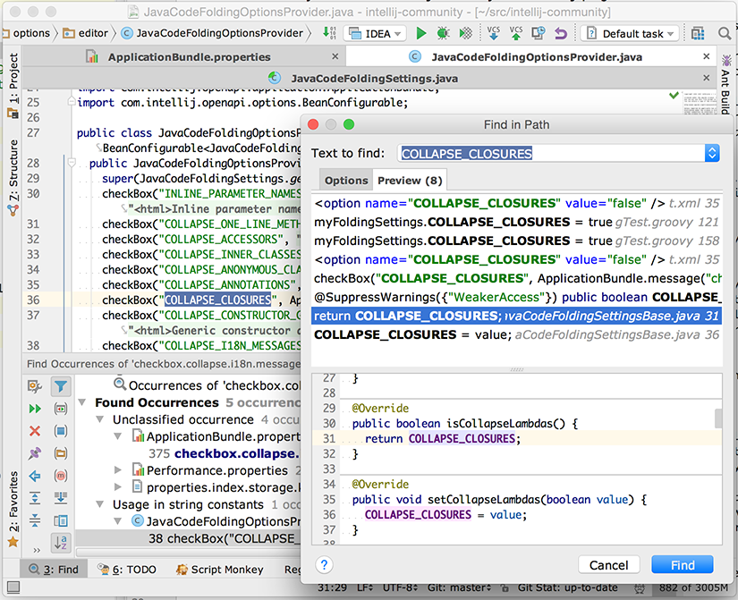

## Finding code in intellij-community sources

I always found that the best and most accurate source of information about any program is its source code. It is not the easiest to absorb, at first, but it is down right the most accurate. Comments can be out of date and cannot be trusted. Who updates them anyway? Books are only valid for the version of code for which they were written. The source code is the final arbiter of truth about any program. After all, it is the program. 

Learning to come up to speed quickly with other peoples' code is a skill that every developer should have under their belt. The reason is simple. After years, or sometimes as little as a few months, even your own code starts to look like "someone else's" code. Therefore an ability to orient yourself in unfamiliar code is a necessity for every developer.

Learning your way around the JetBrains OpenAPI platform is an effort that will take time. Don't expect to do it in one sitting or a leisurely weekend read. Having Java and Kotlin under your belt is a definite plus, if not an absolute pre-requisite. The latter depends on how many C like languages you already know and how quickly you can pick up a new one.     

The learning process for doing this on any project is as straight forward as learning anything complex can be. In the end it only requires persistence and time. Strangely enough, it does not require that you make sense of what you are reading right off the bat. It only requires that you keep coming back and actively try to make sense of the information. The wonderful thing about our brain is that it has the capacity to understand and learn without us being consciously aware of how we do it.

The beauty of working with [intellij-community] source base is that you are actually running a working version of the code you are looking at and it just happens to be the best tool to help you find your way around any project, so trying to find how to get something done is a relatively simple matter of finding the source code for a feature you can see or invoke through the GUI.

A major benefit of studying the source for JetBrains platform is that you will probably learn a lot of elegant solutions to complex problems. This could not be said for the majority of programs that I had to work on and is a major motivating factor when I have to dive a little deeper into the code than I originally envisioned.

The downside is that the product is complex and being highly extensible through plugins the implementation can be spread all over. The hardest part is finding the right bread crumb trail to follow. Here I will take you through the process I used to figure out how and where to add "collapse by default" options for markdown elements. Writing about it took much longer than to actually do it.     

This is where a few tricks from someone who has experience in the trenches can speed things up for you. 

### Pre-requisites

I am assuming you have the [IntelliJ IDEA] installed and have gotten to the point where you can build your own working copy of [intellij-community] sources. 

### Goal: Implement `collapse by default` configuration

I wanted to implement user configurable "Collapse by default" settings that are available for Java and other custom languages in settings/preferences under <kbd>Editor > General > Code Folding</kbd> 

Now, I could see that many plugins extend this list but where to start? Choose the most unlikely text to be repeated all over the source code and search. I chose `I18n strings` as a promising candidate. Search in path for it at the root of the project:

Hit find and keep your fingers crossed. You can also use the preview tab but I prefer to see the results in the find tool window that way I can explore various options without having to search again. Pay dirt! We have the bundle that is used for the localization of strings:

Now we repeat the process but this time searching for the message key `checkbox.collapse.i18n.messages` 

Again, pay dirt `JavaCodeFoldingOptionsProvider` sounds like the class that handles customization of folding settings. In general it will be a provider for settings or a handler for actions.  

Now what the hell are those screaming snake case ids in strings? IntelliJ uses a lot of Bean introspection so I suspect that it is a property of a settings provider.  Well, search in path to the rescue:

I was on a lucky streak: `JavaCodeFoldingSettingsBase` looks perfect for what we are looking for.

Now, I already know that both the `JavaCodeFoldingSettingsBase` and `JavaCodeFoldingOptionsProvider` need to have extension entries in the plugin.xml but which ones? Easiest part of the search. Just put your cursor on the identifier and use the Navigate to Declaration. For `JavaCodeFoldingSettingsBase` you are first taken to abstract `JavaCodeFoldingSettings` class and from there to the `IdeaPlugin.xml` file's entry for the service provider.

And the same procedure to find the entry for `JavaCodeFoldingSettingsBase`:

Now it is only a matter of implementing your own classes and registering them in your plugin.xml file. 

90% of the time the hard part is finding what 3 lines of code to implement and how to get the IDE to know they exist. The rest is usually much easier. Sometimes it takes the implementation of multiple providers to have a working feature, as in the case of IntelliLang code injections, but that I will leave for another blog.  

[IntelliJ IDEA]: https://www.jetbrains.com/idea/#chooseYourEdition
[intellij-community]: https://github.com/JetBrains/intellij-community
